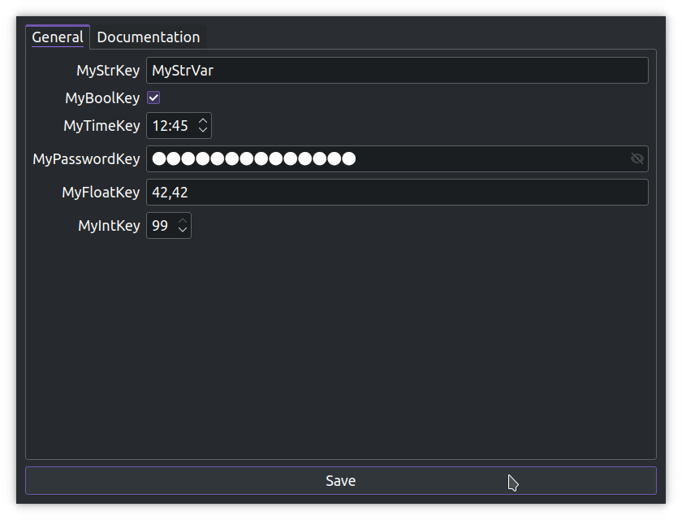
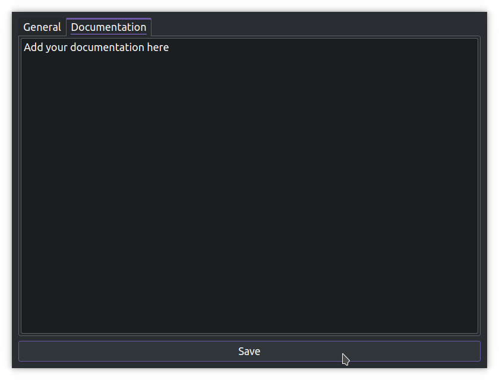

# PyQTConfigCraft

## Table of Contents
1. [Overview](#overview)
2. [Features](#features)
3. [Getting Started](#getting-started)
4. [Dependencies](#dependencies)
5. [Usage](#usage)
6. [License](#license)

## Overview <a name="overview"></a>
PyQTConfigCraft is a Configuration File Manager developed with Python and PyQt5. The goal of PyQTConfigCraft is to simplify the process of editing configuration files by providing a clean, user-friendly GUI. This tool is capable of handling various data types and supports embedded documentation for INI files. 

Whether you are managing complex configuration files or seeking a more efficient way to handle key-value pairs, PyQTConfigCraft is the tool for you.


<div style="display: flex;">
    
    
</div>


## Features <a name="features"></a>
**1. Tabbed Configuration Sections**: PyQTConfigCraft presents each section in the configuration file as a separate tab in the GUI. This intuitive design allows for easy navigation and organization of different configuration sections.

**2. Type-based Key-value Editing**: PyQTConfigCraft intelligently determines the type of the configuration value and provides the user with the appropriate widget for editing. The supported types include:

- **Boolean**: Represented with a checkbox, allowing for easy toggling between true and false.
- **Integer**: Handled with a spin box, providing an efficient way to adjust numeric values.
- **Float**: Managed with a double spin box, perfect for handling decimal numbers.
- **String**: Displayed as a line edit. In cases where the word contain "password", special handling is applied.
- **Time**: Managed with a time edit, providing a convenient tool for setting the time in the HH:mm format.

**3. Password Handling**: If a key contains "password", PyQTConfigCraft treats the corresponding value as a password. This value is hidden by default, but can be revealed by clicking on the eye icon, which allows the user to toggle password visibility.

**4. Documentation Support**: PyQTConfigCraft supports embedded documentation in the 'Documentation' section of the configuration file. This section is represented as a separate tab, and any external links within the documentation are clickable, allowing for easy access to additional resources.

## Getting Started <a name="getting-started"></a>

### Dependencies <a name="dependencies"></a>

PyQTConfigCraft requires the following dependencies:

- Python 3
- PyQt5
- configparser

These can be installed with pip:

```bash
pip install PyQt5 configparser
# or
apt install python3-pyqt5 python3-configargparse
```

### Usage <a name="usage"></a>
1. Clone the repository:

```bash
git clone https://github.com/username/PyQTConfigCraft.git
```

2. Navigate to the directory:

```bash
cd PyQTConfigCraft
```

3. Run the script:
```bash
python main.py
```

4. Use the -f or --config-file option to specify the path to the INI configuration file.
```bash
python main.py -f /path/to/your/config.ini
```
Note: PyQTConfigCraft will create a default configuration file if the file does not exist at the specified path.


PyQTConfigCraft is released under the GPLv3 License.


